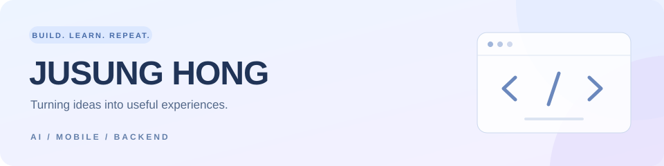

### 안녕하세요, 홍주성입니다 👋

**AI를 일상에서 사용할 수 있는 서비스로 연결합니다.**

옷을 오래 입는 방법부터 안전한 귀갓길, 더 나은 환경까지. 
생활 속 문제를 발견하고, 데이터와 앱으로 해결하는 과정을 기록합니다.

 

## 🌱 About me

- **AI · 데이터** — 이미지 인식과 예측 모델을 서비스에 연결하는 데 관심이 있습니다.
- **앱 · 백엔드** — 모바일 화면부터 API와 데이터까지 이어지는 흐름을 만듭니다.
- **함께 만드는 경험** — 전공종합설계 PBL **Re:wear 팀장**으로 프로젝트를 진행하고 있습니다.

 

## 🛠 Tech stack

논문 연구와 프로젝트에서 사용한 기술입니다.

**AI & Data** 

**Vision Models · 연구에서 활용** 

**Mobile** 

**Backend & Database** 

 

## 🔬 Research

### 의류 소재 인식 · 멀티태스크 학습

옷 한 장의 이미지에서 **혼방 소재와 의류 카테고리를 함께 이해하는 모델**을 연구했습니다.

- **백본 비교** · EfficientNet-B0, ResNet50, MobileNetV2의 소재 다중 라벨 분류 성능 비교
- **구조 설계** · EfficientNet-B0 기반 후반 분기형 멀티태스크 학습과 소재 분기 ECA 적용
- **ViT 확장** · ViT-Small의 전체 공유·후반 분기 구조 및 Token-ECA 적용 비교
- **실험·평가** · ECA·CBAM·CoordAtt·Triplet Attention과 삽입 위치 비교, 분류 성능·파라미터 수·CPU 추론 시간 평가

`Computer Vision` `Multi-label Classification` `Multi-task Learning` `Channel Attention`

 

## 🚀 Projects

### 🌿 [Re:wear](https://github.com/juuu-sung/Re-wear-project)
**내 옷을 이해하고, 오래 입고, 다시 순환시키다.**

AI 의류 분석과 착용·세탁 기록, 리폼과 나눔을 연결하는 지속가능 옷 관리 플랫폼입니다.

- **AI 분석** · 의류 소재·카테고리 분류, 케어라벨 인식과 관리 가이드
- **모바일 서비스** · 디지털 옷장, 착용·세탁 캘린더, 커뮤니티
- **전공종합설계 PBL** · 팀장

`React Native` `Expo` `FastAPI` `PostgreSQL` `PyTorch` `YOLOv8`

### 🧡 [CareMate](https://github.com/juuu-sung/CareMate)
**시니어의 일상에, 든든한 돌봄을 더하다.**

시니어와 보호자를 연결하는 AI 생활·안전 돌봄 앱을 개발하고 있습니다.

- **음성 AI** · 고령자·방언 발화에 맞춘 Whisper 학습과 음성 대화
- **일상 관리** · 복약 알림·기록, 일정 관리와 음성 기반 요청 처리
- **보호자 연계** · 돌봄 현황 대시보드, 위치 확인과 SOS 알림

`React Native` `Expo` `FastAPI` `PostgreSQL` `Whisper`

### 🛡️ [SafeWay](https://github.com/juuu-sung/SafeWay)
**혼자 걷는 귀갓길에, 안심을 더하다.**

사용자와 보호자를 연결하는 Android 안전 동행 앱입니다.

- **위치 공유** · 실시간 위치와 도보 경로를 보호자 화면에 표시
- **위험 알림** · 경로 이탈 감지와 보호자 알림
- **AI 동행** · 음성 입력과 TTS를 활용한 안심 동행 대화

`Android` `Java` `Node.js` `Firebase FCM` `Kakao Maps`

### 🌏 [발전소 NOx 예측](https://github.com/juuu-sung/IndustryAndCommerce)
**데이터로 살펴보는 대기오염.**

산업통상자원부 공모전 데이터분석 부문 프로젝트입니다.

- **데이터 분석** · 배출량·기상·연료 소비 데이터를 활용한 전처리와 변수 설계
- **예측 모델** · XGBoost·LightGBM 앙상블 회귀 모델
- **활용 방향** · 예측 결과와 LLM을 활용한 대기오염 관리

`Python` `XGBoost` `LightGBM` `Gemini API`

 

---

작은 불편을 발견하고, 쓸모 있는 서비스로 바꾸는 개발을 합니다.

